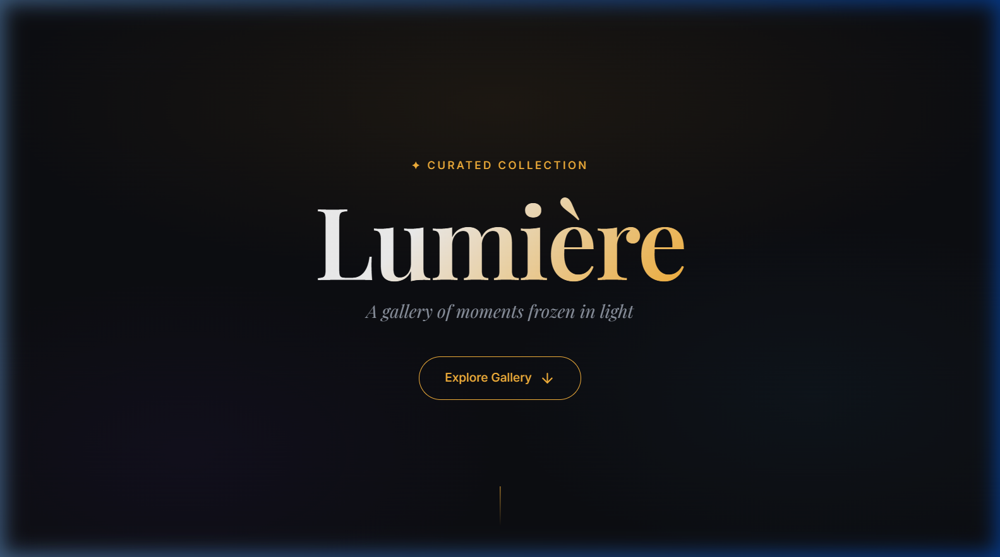
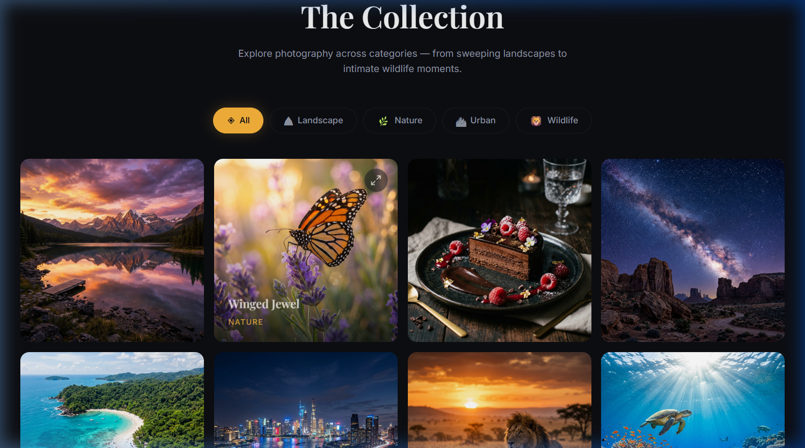
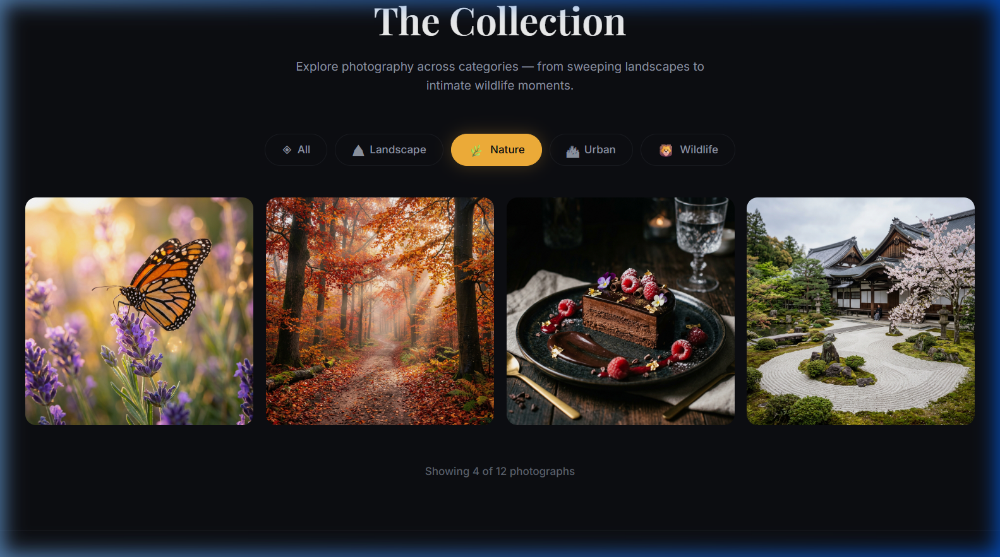
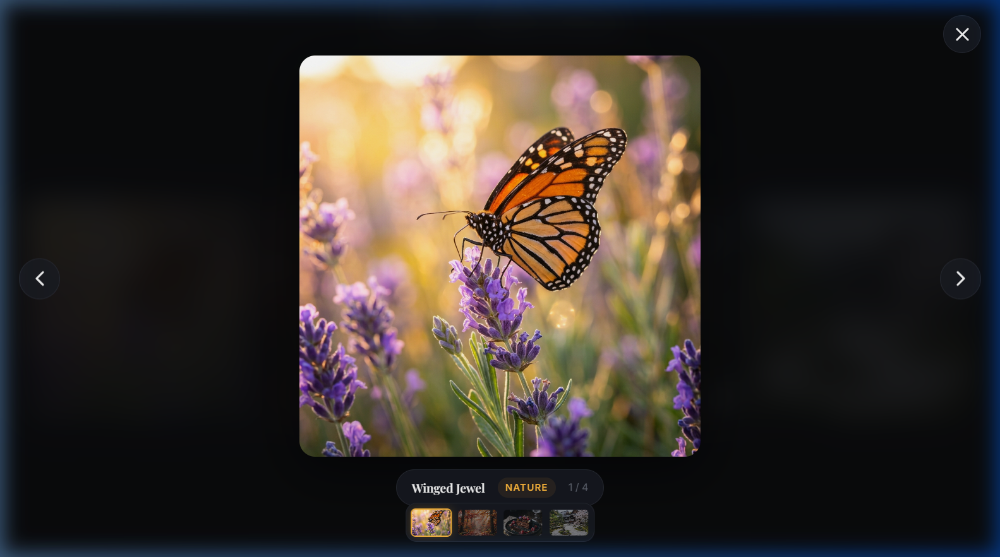

# Lumière — Curated Image Gallery

A modern, responsive, and immersive web-based image gallery crafted using semantic **HTML5**, modern **CSS3**, and interactive **ES6+ JavaScript**. It features a premium dark aesthetic, dynamic category filtering, scroll-reveal animations, and a fully-featured lightbox overlay with keyboard navigation, responsive touch swiping, and metadata/thumbnail strips.

---

## 📸 Project Screenshots

### 1. Hero Landing Section
An elegant, full-viewport introduction displaying the gallery title, subtitle, and an animated explore button set against a shifting backdrop of radial gradients.


### 2. Photography Collection Grid
A responsive masonry-like grid displaying high-quality photographs, each with overlay cards containing metadata and interactive zoom triggers on hover.


### 3. Category Filter
Instant, animated category sorting (Landscape, Nature, Urban, Wildlife) that reflows the grid dynamically while keeping count of displayed items.


### 4. Interactive Lightbox Viewer
An immersive overlay modal utilizing backdrop filters, keyboard navigation, touch swipes, image cross-fading, metadata labels, and a clickable thumbnail strip.


---

## ✨ Features

- **Premium Dark Theme:** Harmonies of custom dark blue surfaces, vibrant gold/amber highlights, and subtle radial gradient backdrops.
- **Glassmorphic UI Elements:** Lightbox controls, info labels, and thumbnail strips styled with backdrop filters (`blur(10px)`) and semi-transparent borders.
- **Responsive Layout:** Adaptive styling optimized for all viewport sizes (desktop, tablet, and mobile), adjusting columns from 4 to 1 dynamically.
- **Dynamic Category Filtering:** Instantly filters images across 4 categories (Landscape, Nature, Urban, Wildlife) with smooth transition effects.
- **Interactive Lightbox:**
  - Full-screen media view with cross-fade image transitions.
  - Interactive thumbnails strip at the bottom representing active position and filtering.
  - Keyboard navigation (left/right arrow keys to switch images, `Esc` to close).
  - Touch-swipe gestures (swipe left/right) for seamless mobile browsing.
- **Scroll Reveal Animations:** Intersection Observer API automatically reveals sections smoothly as the user scrolls.

---

## 📁 Project Structure

```text
image-gallery/
├── index.html          # Core structure, SEO tags, and lightbox structure
├── style.css           # Custom variables, dark system, glassmorphism, responsive grid, animations
├── script.js          # Core gallery logic, filtering logic, and lightbox event handlers
└── images/             # Image directory
    ├── aurora_mountains.png
    ├── autumn_forest.png
    ├── butterfly_flower.png
    ├── city_night.png
    ├── coral_reef.png
    ├── gourmet_dessert.png
    ├── lion_savanna.png
    ├── milky_way_desert.png
    ├── modern_architecture.png
    ├── mountain_lake_sunset.png
    ├── tropical_coastline.png
    ├── zen_garden.png
    ├── screenshot_hero.png      # Captures of the web app
    ├── screenshot_gallery.png
    ├── screenshot_filter.png
    └── screenshot_lightbox.png
```

---

## 🛠️ Technologies Used

- **HTML5:** Semantic architecture, accessible structure (`role="dialog"`, `aria-modal="true"`, `aria-label`).
- **CSS3:** Custom variables, grid columns layout, keyframe animations, glassmorphic styles, responsive media queries.
- **JavaScript (ES6+):** Vanilla script managing DOM creation, active filtering state, custom keyboard navigation, and touch swipe event listeners.

---

## 🚀 How to Run Locally

Since the application uses custom font loading and responsive content, it is best run using a local static file server.

### Option 1: Python HTTP Server (Recommended)
If you have Python installed, open your terminal in the project directory and run:
```bash
python -m http.server 8000
```
Then navigate to [http://localhost:8000](http://localhost:8000) in your web browser.

### Option 2: Node.js (npx)
If you have Node.js installed, run:
```bash
npx http-server -p 8000
```
Then navigate to [http://localhost:8000](http://localhost:8000) in your browser.
